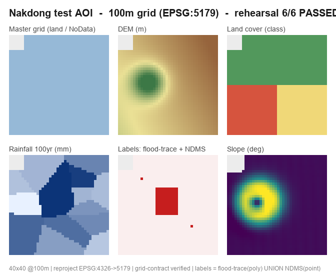

# 격자(100m) 전국 홍수위험도 평가·예측 하네스

이종 원시자료를 전국 100m 표준격자망(EPSG:5179, 수자원단위 대권역/중권역)에 표준화하고, 지형·수문·노출·취약성 인자를 통합해 머신러닝으로 격자별 홍수위험도를 평가·예측하는 **에이전트 하네스**.

## 무엇이 들어 있나
- **`.claude/agents/`** — 전문가 에이전트 8 (데이터 엔지니어·지형·수문·노출취약성·모델러·예측·검증·지도).
- **`.claude/skills/`** — 스킬 9 (표준화 파이프라인, 인자 산출, ML 모델링, 예측, 검증, 지도) + 오케스트레이터. 표준격자망 **격자 계약**·수자원단위 규약·전국 자료원 참조 포함.
- **`src/`** — 자료 유형별 변환 코드와 ML 모델링 코드가 들어가는 골격.
- **`data/`** — 원시자료(point/polygon/raster/tabular/timeseries)·기제작 표준격자망·라벨·유역 드롭존.
- **`config/grid_config.yaml`**, **`env.ps1`**, **`PROJECT_STRUCTURE.md`**.

## 핵심 설계
- **표준격자 계약**: 모든 산출물이 CRS·해상도·원점·NoData·셀정렬 불변식을 준수(`assert_grid_contract`가 강제).
- **ML**: RandomForest·XGBoost·LightGBM·CatBoost·DecisionTree를 침수흔적도 ∪ NDMS 라벨로 학습, **중권역 단위 + 공간 CV**.
- **예측**: 확률강우 재현주기(50/100/200년) 시나리오.
- **QA 우선**: 경계면(좌표계·격자 정합) 불일치를 증분 검증으로 차단.

## 리허설 결과 — 낙동강 테스트 AOI

축소 AOI(경도 128.5, 위도 35.8 · 실제 낙동강권역)에서 합성 데이터로 파이프라인 핵심을 실제 코드(`flood_risk311`)로 검증한 결과. **6/6 통과**.

| 검증 항목 | 결과 |
|----------|:----:|
| 마스터 격자 생성 (EPSG:5179, 100m, 원점 snap, NoData) | ✅ |
| DEM 표준화 (래스터, 4326→5179 재투영·bilinear) | ✅ |
| 토지피복 표준화 (폴리곤, 범주형 nearest) | ✅ |
| 강우 표준화 (포인트 → 최근접 격자화) | ✅ |
| 라벨 격자화 (침수흔적도 폴리곤 ∪ NDMS 포인트) | ✅ |
| **의도적 불일치 자료 차단** (원점 50m 밀림 → 계약 위반 검출) | ✅ |
| 지형 인자 (경사) 산출 | ✅ |

> 위 6개 패널은 리허설이 산출한 실제 격자(`_workspace/`)를 렌더링한 것이다. 합성 데이터·중간 산출물은 git에 포함하지 않는다. 재현: `. .\env.ps1` 후 하네스 실행.

## 시작
1. `. .\env.ps1` — 실행 환경(PROJ/GDAL/UTF-8) 고정. (conda 환경 `flood_risk311` 기준)
2. `data/` 아래 형태별 폴더에 자료를 넣는다 → `PROJECT_STRUCTURE.md` 참조.
3. Claude Code에서 "낙동강권역 홍수위험도 평가해줘" 등으로 `flood-risk-orchestrator` 트리거.

상세 구조·워크플로우는 [`PROJECT_STRUCTURE.md`](PROJECT_STRUCTURE.md)와 [`CLAUDE.md`](CLAUDE.md) 참조.
